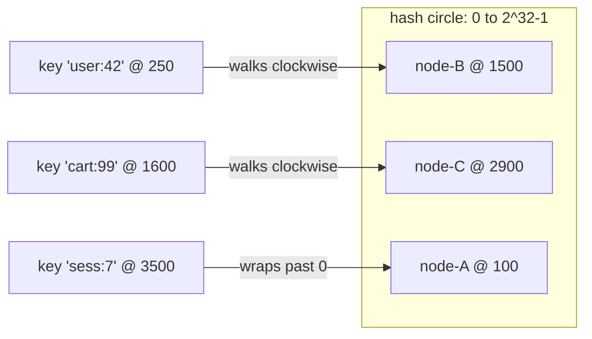

# Consistent Hashing

> Adding one server to a modulo-hashed cache moves 81% of your keys. A hash ring moves 20%. Same
> hardware, same request, one line of different arithmetic.

**Type:** Build
**Language:** Go
**Prerequisites:** Lesson 01 (why system design), Lesson 02 (requirements and estimation)
**Time:** ~75 minutes

## Learning objectives

By the end you will be able to:

- Predict how many keys move when a modulo-mapped cluster changes size, and explain why
- Implement a consistent-hash ring with virtual nodes from scratch, with no dependencies
- Measure key churn and load spread as numbers rather than describing them as adjectives
- Choose a virtual-node count from measured data, and say where the returns stop
- Name the failure modes a ring does *not* fix

## The problem

You run a cache in front of a database. Four cache servers, and a client that picks one:

```go
server := servers[hash(key)%len(servers)]
```

This is correct, it's evenly distributed, and it's what almost everyone writes first. Traffic
grows, so you add a fifth server.

The divisor just changed from 4 to 5. Every key whose hash mod 4 and mod 5 disagree now points
at a different server — and the new server has none of that data. Run the numbers rather than
guessing:

```
$ go run ./cmd/churn

CHANGE           MODULO   RING    IDEAL   RING vs MODULO
2 -> 3 nodes     66.9%    34.3%   33.3%   2.0x better
4 -> 5 nodes     81.0%    25.1%   20.0%   3.2x better
8 -> 9 nodes     89.2%     7.8%   11.1%   11.4x better
16 -> 17 nodes   94.6%     6.5%    5.9%   14.6x better
32 -> 33 nodes   97.1%     3.8%    3.0%   25.7x better
64 -> 65 nodes   98.5%     1.1%    1.5%   86.4x better
```

**81% of keys move.** Every one is now a cache miss that falls through to the database — at the
exact moment you were adding capacity because you were already under load. Adding a server can
take the system down.

And it gets worse as you grow: at 64 nodes, adding one server invalidates **98.5%** of the
cache. The bigger the cluster, the more catastrophic a single change becomes, which is precisely
backwards from what you want.

Note this is not a caching problem. It's the same arithmetic anywhere you map keys to nodes:
shards, partitions, queue consumers, session affinity.

## The concept

### The circle

Stop thinking of nodes as slots in an array and think of them as points on a circle spanning the
whole hash space ($0$ to $2^{32}-1$).

- Hash each **node** to a position on the circle.
- Hash each **key** to a position on the same circle.
- A key belongs to the first node found walking **clockwise** from the key's position.



Now add node-D at position 2000. Which keys move? Only those between node-B (1500) and node-D
(2000) — they used to walk to node-C, now they stop at node-D. **Every other key is untouched**,
because nothing about their walk changed.

That's the whole idea. Modulo makes every key's answer depend on the *number* of nodes.
The ring makes it depend only on the *neighbourhood*, so a change is local.

### Why the churn is 1/N

When you add the $(N{+}1)$-th node, it claims arcs that in aggregate cover about
$\frac{1}{N+1}$ of the circle. Keys in those arcs move; the rest don't. So:

$$
\text{churn} \approx \frac{1}{N+1}
$$

Compare the measured ring column against the ideal column above — 7.8% vs 11.1%, 3.8% vs 3.0%.
It tracks, with hash noise in both directions. That's not a coincidence you have to trust; it's
the geometry, and the test suite asserts it.

### Virtual nodes, and why they're not optional

Here's the part that looks like an implementation detail and isn't. Place each node at exactly
one position, and the arcs are whatever the hash function happened to produce. With five nodes
and 10,000 keys:

```
REPLICAS   SPREAD   VERDICT
1          540.50   unusable
5           16.94   unusable
10          20.19   unusable
50           1.60   usable
150          1.50   usable
500          1.74   usable
```

`SPREAD` is busiest node ÷ quietest node; 1.0 would be perfect. **With one position per node,
the busiest server holds 540x the keys of the quietest.** The churn is already good — but the
load is useless. One machine melts while another idles.

The fix is to place each physical node at many positions (`replicas`, or *virtual nodes*).
Many small arcs average out far better than one large one.

**But read the bottom of that table.** Spread stops improving past ~50 replicas — 500 replicas
(1.74) scores *worse* than 50 (1.60). It's noise in a plateau, not a trend. Past that point
you're paying memory and lookup time for nothing.

This is the lesson's real teaching moment: the plausible belief "more virtual nodes are better"
is false, and you can only find that out by measuring. My first version of the test asserted
monotonic improvement and **failed against the real implementation.**

## Build it

### Step 1: the interface

Both strategies do the same job, so put them behind one interface. That's what makes them
comparable — the benchmark swaps implementations without changing the measurement.

```go
type Mapper interface {
	Get(key string) string
	Add(node string)
	Remove(node string)
	Nodes() []string
}
```

### Step 2: the hash function

```go
func hashKey(s string) uint32 {
	return crc32.ChecksumIEEE([]byte(s))
}
```

CRC32 because it's fast and **reproducible** — the same key lands in the same place on every
machine and every run, which is what makes the numbers in this lesson verifiable instead of
approximate.

It is not a cryptographic hash. If an attacker chooses your keys they can deliberately collide
them onto one node. Real systems facing untrusted input use MurmurHash3, xxHash, or SipHash. See
exercise 4.

### Step 3: modulo, so you have something to beat

```go
func (m *Modulo) Get(key string) string {
	if len(m.nodes) == 0 {
		return ""
	}
	return m.nodes[hashKey(key)%uint32(len(m.nodes))]
}
```

Write the naive version first and keep it. A trade-off you can't measure is a trade-off you're
taking on faith.

### Step 4: the ring

Three pieces of state: sorted positions, a position→node map, and a set of present nodes.

```go
type Ring struct {
	mu       sync.RWMutex
	replicas int
	slots    []uint32          // sorted positions on the circle
	owner    map[uint32]string // slot -> physical node
	present  map[string]bool
}
```

Adding a node places it at `replicas` positions, then re-sorts:

```go
func (r *Ring) Add(node string) {
	for i := 0; i < r.replicas; i++ {
		slot := hashKey(virtualKey(node, i))
		if _, taken := r.owner[slot]; taken {
			continue // never steal an existing arc
		}
		r.owner[slot] = node
		r.slots = append(r.slots, slot)
	}
	sort.Slice(r.slots, func(a, b int) bool { return r.slots[a] < r.slots[b] })
}
```

Two details worth pausing on:

- **`virtualKey(node, i)` is part of the contract.** It's `node + "#" + i`. Change that format
  and every key's placement reshuffles — a full cache flush shipped as a refactor.
- **Collisions skip rather than overwrite.** Overwriting would silently transfer an arc from
  another node. Rare with CRC32, but "rare" and "correct" are different words.

### Step 5: the clockwise walk

The sorted slice makes this a binary search — the only interesting line in the lookup path:

```go
func (r *Ring) Get(key string) string {
	if len(r.slots) == 0 {
		return ""
	}
	h := hashKey(key)
	i := sort.Search(len(r.slots), func(i int) bool { return r.slots[i] >= h })
	if i == len(r.slots) {
		i = 0 // wrap around the top of the circle
	}
	return r.owner[r.slots[i]]
}
```

Lookup is $O(\log(N \times \text{replicas}))$. The `i == len(slots)` case *is* the circle —
without it, keys hashing above the highest slot have no owner.

### Step 6: measure, don't assert

The function that makes the lesson honest:

```go
func Churn(m Mapper, keys []string, mutate func(Mapper)) float64 {
	before := make(map[string]string, len(keys))
	for _, k := range keys {
		before[k] = m.Get(k)
	}
	mutate(m)
	moved := 0
	for _, k := range keys {
		if m.Get(k) != before[k] {
			moved++
		}
	}
	return float64(moved) / float64(len(keys))
}
```

Snapshot, mutate, compare. Any claim about churn is now a number you can reproduce.

## Run it

```bash
go test ./...                    # correctness plus the trade-off assertions
go test -v -run Churn ./...      # see the churn tables
go run ./cmd/churn               # the full comparison
go run ./cmd/churn -keys 100000 -replicas 300
go test -bench . ./...           # lookup cost, ring vs modulo
```

The tests don't just check correctness — they *assert the trade-off*:

- `TestModuloRemapsNearlyEverything` fails if modulo churn drops below 70%
- `TestRingMovesOnlyItsShare` fails if ring churn exceeds 35%
- `TestRingBeatsModuloByAtLeast2x` fails if the gap ever closes
- `TestSpreadPlateaus` records where extra virtual nodes stop paying

If someone breaks the ring in a future refactor, the failure message says which property died.

## Use it

You've now implemented what these use:

| System | Where it appears |
| --- | --- |
| Amazon DynamoDB | Partition assignment across storage nodes |
| Apache Cassandra | Token ring; virtual nodes are configurable per host |
| Memcached clients | Client-side server selection (`ketama`) |
| Envoy / nginx | `ring_hash` and `maglev` load-balancing policies |
| Riak, Voldemort | Directly modelled on the Dynamo paper |

Cassandra's `num_tokens` is exactly this lesson's `replicas`. Its default has moved down over
the years — from 256 to 16 — because large values cost repair and gossip time without buying
proportional balance. The same plateau you measured in step 6.

## Ship it

`code/` is a dependency-free Go package you can lift into a project:

- `Mapper` — swap strategies behind one interface
- `Ring` — consistent hashing with virtual nodes, safe for concurrent use
- `Churn`, `Spread`, `Distribution` — measurement helpers for your own experiments

Concurrency note: `Ring` guards its state with a `sync.RWMutex`, so `Get` is safe under parallel
load while `Add`/`Remove` take the write lock. That's adequate for topology changes measured in
minutes, which is what they are. It's not adequate for a hot path that rebuilds the ring per
request — if you need that, look at copy-on-write with an `atomic.Pointer`.

## What consistent hashing does *not* solve

Worth being blunt, because the ring is often oversold:

- **Hot keys.** One viral key is one hash. It maps to one node no matter how many virtual nodes
  you configure. You need replication or request coalescing for that.
- **Heterogeneous hardware.** A node twice as powerful should own twice the arc. Weighting means
  scaling `replicas` per node — the implementation here assumes uniform capacity.
- **Data movement.** The ring tells you a key's *new owner*. Something still has to copy the
  data there, or accept the miss. That's a separate mechanism.
- **Coordination.** Every client needs the same view of the node set. Disagreement means
  different clients writing the same key to different nodes. That's service discovery's job.
- **The cold-start miss itself.** 20% churn is far better than 81%, but it isn't zero. At high
  traffic even 1% of misses can be a thundering herd.

## Exercises

1. **Easy — weighted nodes.** Give `Add` a weight so a node with weight 2 gets twice the virtual
   nodes. Verify with `Distribution` that it receives ~2x the keys.
2. **Medium — bounded loads.** Implement the "consistent hashing with bounded loads" rule: a
   node may not exceed $c$ times the average, and overflow walks to the next node. Measure the
   effect on `Spread` and on churn. What did you trade?
3. **Medium — find your own plateau.** Sweep `replicas` from 1 to 1000 for 3, 10, and 50 nodes.
   Where do the returns stop for each? Does the answer depend on node count?
4. **Hard — adversarial keys.** Write a program that finds keys colliding onto one node under
   CRC32. Then swap in a seeded hash and show the attack no longer works.
5. **Hard — jump consistent hash.** Implement Google's jump consistent hash. It needs no ring
   and no memory. Compare churn, spread, and speed. Why doesn't it replace the ring everywhere?
   (Hint: try removing a node that isn't the last one.)

## Key terms

| Term | What people say | What it actually means |
| --- | --- | --- |
| Consistent hashing | "It spreads keys evenly" | It bounds *how many keys move* when the node set changes. Even distribution comes from virtual nodes, not from the ring |
| Virtual node | "An implementation trick" | Load-fairness mechanism. Without it, spread was 540x in our measurement |
| Churn / remap ratio | "Some keys move" | The measurable fraction that changes owner: ~1/N for a ring, ~1 for modulo |
| Hash ring | "A circular buffer" | A conceptual circle. In code it's a sorted array plus a binary search |
| Hot key | "Solved by more vnodes" | Not solved at all. One key is one position; needs replication |

## Further reading

- [Consistent Hashing and Random Trees](https://www.cs.princeton.edu/courses/archive/fall09/cos518/papers/chash.pdf) — Karger et al., 1997, the original paper
- [Dynamo: Amazon's Highly Available Key-value Store](https://www.allthingsdistributed.com/files/amazon-dynamo-sosp2007.pdf) — section 4.2 covers virtual nodes in production
- [Consistent Hashing with Bounded Loads](https://arxiv.org/abs/1608.01350) — the overflow rule from exercise 2
- [A Fast, Minimal Memory, Consistent Hash Algorithm](https://arxiv.org/abs/1406.2294) — jump consistent hash, exercise 5
- [Cassandra's num_tokens guidance](https://cassandra.apache.org/doc/stable/cassandra/getting_started/production.html) — why the default dropped from 256 to 16
