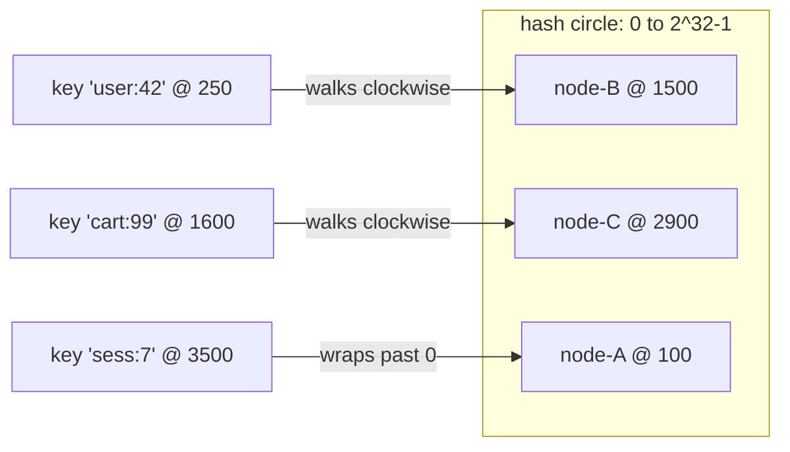
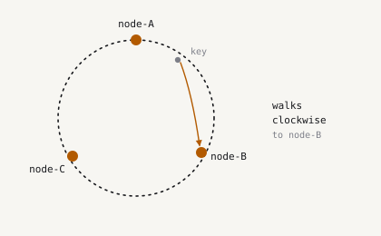

# Consistent Hashing

> Adding one server to a modulo-hashed cache moves 81% of your keys. A hash ring moves 20%. Same
> hardware, same request, one line of different arithmetic.

**Type:** Concept
**Prerequisites:** Lesson 01 (why system design), Lesson 02 (estimation)
**Time:** ~45 minutes

## Learning objectives

By the end you will be able to:

- Predict how many keys move when a modulo-mapped cluster changes size, and explain why
- Describe the clockwise-walk rule and why it makes a topology change *local*
- Distinguish churn from load spread, and say which mechanism fixes which
- Choose a virtual-node count from measured data, and say where the returns stop
- Name the failure modes a hash ring does *not* fix

## 1. The problem

You run a cache in front of a database. Four cache servers, and a client that picks one:

```text
server ← servers[hash(key) mod count(servers)]
```

This is correct, evenly distributed, and what almost everyone writes first. Traffic grows, so
you add a fifth server.

The divisor just changed from 4 to 5. Every key whose `hash mod 4` and `hash mod 5` disagree now
points at a different server — and that server holds none of its data.

Rather than guess how many keys that is, measure it. The script in this lesson maps 10,000 keys
and reports how many change owner:

```
$ python3 code/hashring.py

CHANGE            MODULO    RING   IDEAL   RING vs MODULO
2 -> 3 nodes      66.9%   34.3%   33.3%   2.0x better
4 -> 5 nodes      81.0%   25.1%   20.0%   3.2x better
8 -> 9 nodes      89.2%    7.8%   11.1%   11.4x better
16 -> 17 nodes    94.6%    6.5%    5.9%   14.6x better
32 -> 33 nodes    97.1%    3.8%    3.0%   25.7x better
64 -> 65 nodes    98.5%    1.1%    1.5%   86.4x better
```

**81% of keys move.** Every one is now a cache miss falling through to the database — at exactly
the moment you were adding capacity because you were already under load. Adding a server can
take the system down.

And it worsens as you grow: at 64 nodes, adding one server invalidates **98.5%** of the cache.
The larger the cluster, the more catastrophic a single change becomes, which is precisely
backwards from what you want.

This is not a caching problem. It is the same arithmetic anywhere you map keys to nodes: shards,
partitions, queue consumers, session affinity.

## 2. The idea

Stop thinking of nodes as slots in an array. Put them on a circle spanning the whole hash space,
$0$ to $2^{32}-1$.

- Hash each **node** to a position on the circle.
- Hash each **key** to a position on the same circle.
- A key belongs to the first node found walking **clockwise** from the key's position.



Now add node-D at position 2000. Which keys move? Only those between node-B (1500) and node-D
(2000) — they used to walk on to node-C, and now they stop earlier. **Every other key is
untouched**, because nothing about its walk changed.

That is the whole idea:

- **Modulo** makes every key's answer depend on the *number* of nodes.
- **The ring** makes it depend only on the *neighbourhood*, so a change stays local.



### In pseudocode

Placing a node is a loop; finding a key's owner is a binary search over sorted positions.

```text
function Add(node):
    for i ← 0 to replicas - 1:
        slot ← hash(node + "#" + i)
        if slot already occupied:
            continue                  # never steal an existing arc
        owner[slot] ← node
        insert slot into slots, keeping slots sorted

function Get(key):
    if slots is empty:
        return NONE
    i ← index of first slot ≥ hash(key)   # binary search
    if i is past the end:
        i ← 0                             # wrap around the circle
    return owner[slots[i]]

function Remove(node):
    drop every slot whose owner is node
```

Three things in there matter more than they look:

- **`node + "#" + i` is part of the contract.** It determines every position on the circle.
  Change that format and the whole topology reshuffles — a full cache flush shipped as a
  refactor.
- **Collisions skip rather than overwrite.** Overwriting would silently transfer an arc away from
  another node.
- **The wrap is the circle.** Without `i ← 0`, every key hashing above the highest position has
  no owner at all.

Lookup costs $O(\log(N \times \text{replicas}))$ — the binary search. Everything else is
bookkeeping.

## 3. Why the churn is 1/N

When you add the $(N{+}1)$-th node, the arcs it claims cover about $\frac{1}{N+1}$ of the circle.
Keys in those arcs move; the rest do not:

$$
\text{churn} \approx \frac{1}{N+1}
$$

Compare the measured RING column against IDEAL in the table above — 7.8% against 11.1%, 3.8%
against 3.0%. It tracks, with hash noise in both directions. That is not a coincidence you have
to take on trust; it is the geometry, and the script reproduces it on demand.

Removal behaves the same way, which matters because removal is what a crash looks like:

```
Removing a node (what a crash looks like):
CHANGE            MODULO    RING   IDEAL
4 -> 3 nodes      75.1%   23.1%   25.0%
8 -> 7 nodes      87.2%   14.9%   12.5%
16 -> 15 nodes    93.9%    5.0%    6.2%
```

## 4. Virtual nodes, and why they are not optional

Here is the part that looks like an implementation detail and is not.

Place each node at exactly **one** position and the arcs are whatever the hash happened to
produce. Churn is already fine — but look at the load:

```
Why virtual nodes exist (5 nodes, busiest/quietest ratio):
 REPLICAS   SPREAD   VERDICT
        1   540.50   unusable
        5    16.94   unusable
       10    20.19   unusable
       50     1.60   usable
      150     1.50   usable
      500     1.74   usable
```

`SPREAD` is busiest node ÷ quietest node, so 1.0 would be perfect. **With one position per node,
the busiest server holds 540x the keys of the quietest.** One machine melts while another idles.

The fix is to give each physical node many positions on the circle — `replicas`, or *virtual
nodes*. Many small arcs average out far better than one large one.

**But read the bottom of that table.** Spread stops improving past roughly 50 replicas: 500
(1.74) scores *worse* than 50 (1.60). That is noise inside a plateau, not a trend. Past that
point you pay memory and lookup time for nothing.

This is the lesson's real teaching moment. The plausible belief *"more virtual nodes are always
better"* is false, and only measurement reveals it. The first version of this lesson's test
asserted monotonic improvement and **failed against the real implementation**.

Churn and spread are different properties, fixed by different things:

| Property | What it measures | What fixes it |
| --- | --- | --- |
| Churn | Fraction of keys that move on a topology change | The ring itself |
| Spread | Busiest node ÷ quietest node | Virtual nodes, up to the plateau |

## 5. Run it

One script, no dependencies. It is short enough to read in full, and reading it is optional —
the point is that every number above came out of it.

```bash
python3 code/hashring.py
python3 -m pytest code/test_hashring.py -q    # asserts the trade-off, not just correctness
```

The tests are unusual in that they assert the *teaching*:

- `test_modulo_remaps_nearly_everything` fails if modulo churn drops below 70%
- `test_ring_moves_only_its_share` fails if ring churn exceeds 35%
- `test_ring_beats_modulo_by_at_least_2x` fails if the gap ever closes
- `test_spread_plateaus` records where extra virtual nodes stop paying

If someone breaks the ring in a later refactor, the failure message names which *idea* died.

## 6. Use it

You have now seen what these do:

| System | Where it appears |
| --- | --- |
| Amazon DynamoDB | Partition assignment across storage nodes |
| Apache Cassandra | Token ring; virtual nodes configurable per host |
| Memcached clients | Client-side server selection (`ketama`) |
| Envoy, nginx | `ring_hash` and `maglev` load-balancing policies |
| Riak, Voldemort | Modelled directly on the Dynamo paper |

Cassandra's `num_tokens` is exactly this lesson's `replicas`. Its default dropped from 256 to 16
over the years, because large values cost repair and gossip time without buying proportional
balance — the same plateau you just read off the table.

## 7. What consistent hashing does *not* solve

Worth being blunt, because the ring gets oversold:

- **Hot keys.** One viral key is one hash, so it maps to one node no matter how many virtual
  nodes you configure. That needs replication or request coalescing.
- **Heterogeneous hardware.** A node twice as powerful should own twice the arc. That means
  weighting replicas per node; the plain version assumes uniform capacity.
- **Data movement.** The ring tells you a key's *new owner*. Something still has to copy the data
  there, or accept the miss.
- **Coordination.** Every client needs the same view of the node set, or two clients write the
  same key to different nodes. That is service discovery's job.
- **The cold-start miss itself.** 20% churn beats 81%, but it is not zero. At high traffic even
  1% of misses can be a thundering herd.

## Exercises

1. **Easy — weighted nodes.** Give a node a weight so weight 2 gets twice the virtual nodes.
   Verify with the distribution helper that it receives roughly twice the keys.
2. **Medium — find your own plateau.** Sweep `replicas` from 1 to 1000 for 3, 10 and 50 nodes.
   Where do the returns stop for each? Does the answer depend on node count?
3. **Medium — bounded loads.** Add the rule that no node may exceed $c$ times the average, with
   overflow walking to the next node. Measure the effect on spread *and* on churn. What did you
   trade?
4. **Hard — adversarial keys.** CRC32 is not cryptographic. Find keys that collide onto one node,
   then show a seeded hash defeats the attack.
5. **Hard — jump consistent hash.** Google's version needs no ring and no memory. Compare churn,
   spread and speed. Why has it not replaced the ring everywhere? (Try removing a node that is
   not the last one.)

## Key terms

| Term | What people say | What it actually means |
| --- | --- | --- |
| Consistent hashing | "It spreads keys evenly" | It bounds *how many keys move* when the node set changes. Even distribution comes from virtual nodes, not from the ring |
| Virtual node | "An implementation trick" | The load-fairness mechanism. Without it, measured spread was 540x |
| Churn / remap ratio | "Some keys move" | The measurable fraction that changes owner: ~1/N for a ring, ~1 for modulo |
| Hash ring | "A circular buffer" | A conceptual circle. In practice a sorted array plus a binary search |
| Hot key | "Solved by more vnodes" | Not solved at all. One key is one position; needs replication |

## Further reading

- [Consistent Hashing and Random Trees](https://www.cs.princeton.edu/courses/archive/fall09/cos518/papers/chash.pdf) — Karger et al., 1997, the original paper
- [Dynamo: Amazon's Highly Available Key-value Store](https://www.allthingsdistributed.com/files/amazon-dynamo-sosp2007.pdf) — section 4.2 covers virtual nodes in production
- [Consistent Hashing with Bounded Loads](https://arxiv.org/abs/1608.01350) — the overflow rule from exercise 3
- [A Fast, Minimal Memory, Consistent Hash Algorithm](https://arxiv.org/abs/1406.2294) — jump consistent hash, exercise 5
- [Cassandra production guidance](https://cassandra.apache.org/doc/stable/cassandra/getting_started/production.html) — why `num_tokens` dropped from 256 to 16
