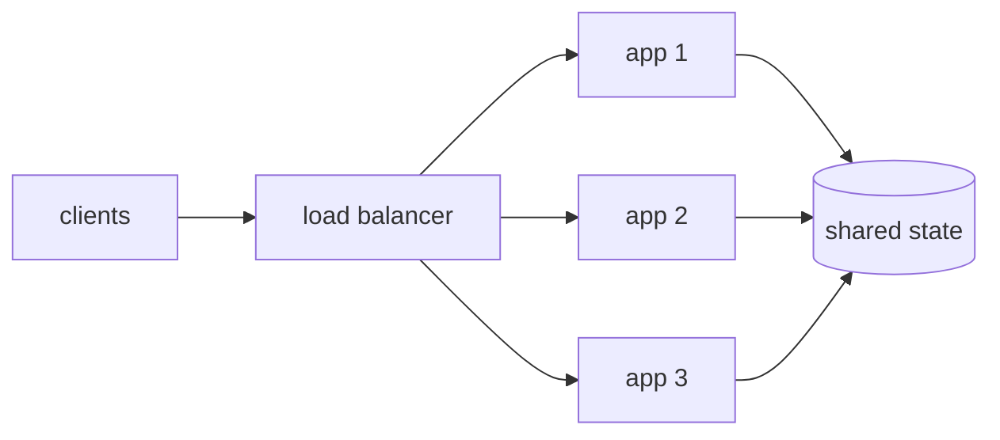

# Vertical and Horizontal Scaling

> In 1986 a CPU doubled in speed every 1.7 years. Since 2015 it takes 20.1. Waiting for
> faster hardware stopped being an engineering strategy inside one career.

**Type:** concept
**Prerequisites:** Lesson 01 (functional vs non-functional requirements), Lesson 02 (back-of-envelope calculations)
**Time:** ~40 minutes

## Learning objectives

By the end you will be able to:

- Define scaling up and scaling out, and say which problem each one actually solves
- Explain why vertical scaling gets expensive at high configurations, with published prices
- Name the one design property horizontal scaling depends on, and what breaks without it
- List the six complexities you take on the moment you scale out
- Predict the ceiling a serial fraction puts on a cluster before you pay for it
- Split a system into the parts you scale up and the parts you scale out, and defend it

## 1. Two ways to handle more load

```text
vertical    (scaling up)   ← make the existing servers more powerful
horizontal  (scaling out)  ← add more servers of the same size
```

Everyone reaches for vertical first, and that instinct is usually correct. It needs no
code changes and no new moving parts. The question is not which one is better — it is
where each one stops, and what the other one costs you in exchange.

## 2. Vertical scaling: making the existing server more powerful

Upgrade the hardware under the same machine: more cores, more RAM, faster disk. The
program does not change. Nothing new gets deployed.

### Why it gets expensive at high configurations

Small and medium upgrades are priced fairly. The pain starts once you leave the
commodity range, because very large machines are specialised and rare — few customers
need 24 TB of RAM in one box, so there is no volume to spread the cost over:

```
$ python3 code/scaling.py

What the top of the ladder costs (EC2 on-demand, us-east-1, Sep 2026):
INSTANCE                vCPU     GiB    $/HOUR  $/vCPU-HR  vs SMALL
m7i.large                  2       8      0.10     0.0504     1.00x
m7i.48xlarge             192     768      9.68     0.0504     1.00x
u7i-12tb.224xlarge       896   12288    125.58     0.1402     2.78x
u7in-16tb.224xlarge      896   16384    180.48     0.2014     4.00x
u7in-24tb.224xlarge      896   24576    270.73     0.3022     6.00x
```

Read the `$/vCPU-HR` column, and read it in two halves.

**Inside the commodity range the rate is flat.** From 2 vCPUs to 192 — a 96x size
increase — the price is $0.0504 per vCPU-hour at every rung. If you scale up within a
general purpose family, you pay exactly proportionally, and you have not been overcharged
for the convenience.

**Past the ceiling the rate escalates.** `m7i` stops at 192 vCPUs. Every machine above
that is a specialised high-memory family, and the per-unit price climbs: **2.78x, then
4.00x, then 6.00x** the commodity rate. That is the shape people mean when they say
vertical scaling gets expensive, and it is worth knowing precisely where it starts,
because below that line the objection does not apply.

The reason is the same one that ended the free lunch in the first place:

```
How long you wait for a CPU twice as fast (Hennessy & Patterson, fig 1.17):
ERA                             GROWTH/YEAR   DOUBLES IN
1986-2003  superscalar era            52.0%       1.7 yr
2003-2011  end of Dennard             23.0%       3.3 yr
2011-2015  multicore only             12.0%       6.1 yr
2015-      present                     3.5%      20.1 yr
```

Before roughly 2003 you could ship a slow program and let Intel fix it — single-thread
speed doubled every 1.7 years on its own. It now takes **20.1 years**.

**One correction worth making, because the shorthand is everywhere:** Moore's law is not
what broke. Moore's 1965 observation was about transistor *count* per die, and that
largely held. What ended, around 2005, was **Dennard scaling** — the property that a
smaller transistor could also run at lower voltage, keeping power density flat as clocks
rose. Once that stopped, extra transistors could no longer buy a faster core, so they
bought *more* cores.

That has a direct consequence for scaling up. "A bigger machine" now means "a machine
with more cores", each running at roughly last generation's speed. If your program cannot
use many cores, a bigger machine buys you very little — which is why section 5 puts a
number on parallelism before you spend anything.

### Where vertical scaling is the right answer

Small to medium applications, and any system whose bottleneck is a single logical thing
that cannot be split: a primary database, a single-writer ledger, an in-memory working
set that must stay in one address space.

| Advantages | Disadvantages |
| --- | --- |
| Simple to manage — one machine, one config | Hard hardware limit; the largest box sold is the end of the road |
| No distributed system complexity | Single point of failure; throughput improves, availability does not |
| Performance boost is instant | Expensive at high configurations (2.78x to 6.00x above) |
| No code changes required | Upgrades usually require downtime |
| Backup and recovery are straightforward | No geographic distribution possible |
| Monitoring and debugging stay simple | A bigger box means more cores, which needs a parallel program |

The last row on each side is the pair to remember. Vertical scaling's simplicity is real
and undervalued; its ceiling is absolute and arrives without warning.

## 3. Horizontal scaling: adding more servers of the same size

Run the same program on N machines and split traffic between them:



The diagram is the easy part. It only works if one property holds.

### The fundamental principle: stateless design

**Any request must be servable by any server.** That is the whole condition, and the
usual thing that violates it is the user's session.

In a *stateful* design, session details live in the memory of whichever server handled
the login. Add a second server, and the moment the load balancer sends that user's next
request elsewhere, the new server has never heard of them — so it asks them to log in
again. That is not a rare edge case; with two servers it is roughly half of all requests.
It is the single biggest obstacle to scaling out.

The fix is to stop keeping the session on the server. Instead of a session in server
memory, issue a signed token — a JWT — and let the client carry it:

```text
stateful:    browser --(cookie: session-id)--> server 2 --> "who are you?"
                                                            session lives on server 1

stateless:   browser --(JWT: signed claims)--> server 2 --> verifies signature, proceeds
                                                            every server can verify it
```

Each request now arrives carrying its own proof of identity, and **any** server can
verify it without asking another server anything. The session is no longer state the
cluster has to share.

The alternative is to move the session into a shared store — Redis, a database — which is
also stateless *from the app server's point of view*, and is what you use when tokens do
not fit (you need instant revocation, or the session is too big for a header). Either way
the rule is the same: the state leaves the app process.

Once that holds, two properties fall out almost for free:

- **Autoscaling.** Servers are interchangeable, so a controller can add them when traffic
  rises and remove them when it drops. Vertical scaling cannot do this — you cannot resize
  a machine every ten minutes, and you certainly cannot resize it downward at 3 a.m.
  without a restart.
- **Natural fault tolerance.** A dead server takes out a fraction of capacity instead of
  the whole service, and the load balancer routes around it. This is redundancy you get as
  a side effect of the shape, not something you bought.
- **Geographic distribution.** Servers in Mumbai and Frankfurt serve their own regions.
  One big machine has exactly one location, and everyone far away pays the latency.

### What you take on in exchange

Scaling out does not remove complexity, it moves it into the spaces between the servers.
Six things you now own:

| Complexity | Why it appears |
| --- | --- |
| Load balancers | Something has to distribute requests, and it must not itself be a single point of failure |
| Service discovery | Servers come and go under autoscaling; hardcoded addresses stop working |
| Centralised logging | A single request's story is now split across N machines. Grepping one box tells you nothing |
| Data consistency | Multiple writers against shared data means conflicts and race conditions you never had |
| The local state problem | Anything on local disk — uploads, temp files, in-process caches — exists on one server only |
| Distributed cache consistency | N in-process caches drift apart, so different users see different answers to the same question |

None of these is optional, and each is a later lesson. The honest summary of horizontal
scaling is that it converts a hardware problem you cannot solve into a set of software
problems you can — at the cost of every one of them.

## 4. The hybrid approach, which is what production actually looks like

The choice is not made once for the whole system. It is made per component, and the split
that shows up repeatedly is:

| Component | Strategy | Why |
| --- | --- | --- |
| App servers | Horizontal | Stateless by design, so adding servers is cheap and autoscaling works |
| Database (writes) | Vertical, as far as it goes | One consistent writer is the easiest correct thing; scale up until the box runs out, then shard |
| Database (reads) | Horizontal | Read replicas need no write coordination |
| Cache | Horizontal | Shard the keyspace; each node owns a slice |

Scale the database up as much as possible, and scale the app tier out. That ordering is
deliberate: sharding a database is one of the most expensive changes a system can make, so
it is worth paying the price cliff from section 2 to postpone it. Buying a 2.78x per-vCPU
machine is cheaper than a migration that risks your data.

## 5. The trade-off this lesson teaches: N servers do not give you N times the throughput

Here is the number that decides whether scaling out will even work, and it has nothing to
do with price. Split work across N machines and the parallel part gets N times faster. The
serial part — one lock, one shared counter, one leader assigning work — does not get faster
at all:

$$
S(N) = \frac{1}{s + \frac{1 - s}{N}}
$$

where $s$ is the fraction that stays serial. As $N$ grows the second term vanishes, so
speedup is capped at $\frac{1}{s}$ regardless of how much you spend:

```
Amdahl: what a serial fraction does to machines you already paid for:
 SERIAL     N=4    N=16    N=64  N=1024   CEILING
     1%     3.9    13.9    39.3    91.2    100.0x
     5%     3.5     9.1    15.4    19.6     20.0x
    20%     2.5     4.0     4.7     5.0      5.0x
```

Read the 5% row. **64 servers deliver 15.4x, not 64x** — you are paying for 64 and
receiving less than a quarter of it. And 5% serial is not pathological; it is one shared
counter.

Read the 20% row for the sharper version. **Going from 64 servers to 1024 moves you from
4.7x to 5.0x**: sixteen times the bill for 6% more throughput. Past $\frac{1}{s}$ you are
buying nothing at all.

This is the honest bound on horizontal scaling, and it is why "just add more servers" is
not a plan. Every scaling proposal should state its estimated $s$, because $\frac{1}{s}$
is where the money stops working.

It gets worse than this in practice. Amdahl assumes extra servers merely fail to help;
Neil Gunther's Universal Scalability Law adds a term for the crosstalk between them —
cache invalidation, gossip, lock handoff — which grows with the *square* of the cluster
size, so throughput can actually **decrease** past some size. If you have ever added a
node and watched latency get worse, that is the effect, and it is in the further reading.

## 6. Run it

```bash
python3 code/scaling.py
python3 -m unittest discover -s code -q
```

Stdlib only, no setup. The script is deliberately small — this lesson is about a
judgement, not an implementation — and exists only to produce the three figures the doc
would otherwise be asserting. The tests assert the *teaching* alongside the arithmetic:

- `test_waiting_for_hardware_stopped_being_a_strategy` fails if the eras stop differing by 10x
- `test_commodity_range_is_priced_proportionally` fails if a premium appears below 192 vCPUs
- `test_price_escalates_past_the_commodity_ceiling` fails if the specialised rungs stop climbing
- `test_serial_fraction_caps_speedup_at_its_reciprocal` pins Amdahl's ceiling at $\frac{1}{s}$
- `test_five_percent_serial_wastes_most_of_a_large_cluster` pins the 64-server figure

If a later change breaks a claim, the failure names the idea that died.

## 7. Use it

| System | Where the choice shows up |
| --- | --- |
| Kubernetes | `HorizontalPodAutoscaler` adds pods; `VerticalPodAutoscaler` resizes them |
| AWS Auto Scaling | `DesiredCapacity` on an ASG is scaling out; `ModifyInstanceAttribute` is scaling up |
| PostgreSQL | Writes scale up until you shard; reads scale out via streaming replicas |
| Redis | Single-threaded command execution per shard, so scaling up buys little; Cluster mode shards |
| Stack Overflow | 11 web servers and 4 SQL Servers served 209M HTTP requests/day (2016), deliberately vertical |

The Redis row is the parallelism argument from section 5 in real life. A Redis shard runs
commands on one thread, so its serial fraction is effectively 1 and extra cores cannot
help — going from 8 vCPUs to 96 does almost nothing. Shard count is the only knob that
matters.

The Stack Overflow row is worth sitting with. At 209 million HTTP requests and 66 million
page loads *per day*, their published 2016 architecture ran on 11 web servers and 4 SQL
Servers — and they noted they only *needed* one web server, having accidentally proved it
a few times. Very few very large machines, on the argument that one big SQL Server with the
working set in RAM beats a distributed system they would have to operate. That is a
defensible senior answer, and it is the opposite of the reflex.

## 8. What scaling does *not* solve

- **A slow algorithm.** An $O(n^2)$ query on 10 servers is still $O(n^2)$. Scaling divides
  the *volume* of work, never the cost of each unit. Profile first: a 10x algorithmic win
  is cheaper than 10 servers and needs no load balancer.
- **Write contention on shared state.** Ten stateless app servers hitting one primary
  database moved the bottleneck, they did not remove it.
- **Work that cannot be parallelised.** With $s$ near 1, a fleet buys nothing. Buy clock
  speed, or restructure the job.
- **Latency for a single request.** Scaling adds throughput. One request does not get
  faster because there are more servers — it usually gets marginally slower, having gained
  a hop through the load balancer.
- **Operational cost.** Deploys, config rollout, and debugging all get harder with every
  server added, and none of that appears in the price table.

## Exercises

1. **Easy — find your own cliff.** Replace `EC2_LADDER` with your cloud's current prices.
   At which instance size does the per-vCPU rate first rise above the commodity rate? Is
   your provider's cliff steeper or shallower than 2.78x?
2. **Easy — estimate your $s$.** Take a service you know. Name every serialised step: a
   lock, a leader, a single-writer table, a sequential ID generator. Estimate $s$, compute
   $\frac{1}{s}$, and compare it against the replica count you actually run.
3. **Medium — find the local state.** Pick a running service and list everything that
   would be lost or wrong if the next request landed on a different instance: sessions,
   uploaded files, in-process caches, scheduled jobs, rate-limit counters. Which of the six
   complexities does each one belong to?
4. **Medium — argue the other side.** Write the case for keeping a system on one large
   machine at your current traffic, using the price table and the availability requirement.
   Then say what specific event would change your answer.
5. **Hard — JWTs are not free.** A token cannot be revoked before it expires without
   server-side state, which reintroduces the thing you removed. Design a logout that is
   immediate, and say exactly how much statelessness you gave back to get it.

## Key terms

| Term | What people say | What it actually means |
| --- | --- | --- |
| Vertical scaling | "Expensive per unit of compute" | True only past the commodity ceiling. Below 192 vCPUs the rate is flat at $0.0504/vCPU-hour; above it the specialised families cost 2.78x to 6.00x |
| Horizontal scaling | "Just add more servers" | Valid only once any request can be served by any server. Before the state leaves the process it adds capacity and breaks correctness |
| Stateless | "The server stores nothing" | The server stores nothing *about a specific client between requests*. It still has config, connections and caches — what it must not have is the only copy of your session |
| Moore's law | "CPUs stopped getting faster" | Moore's law is about transistor count and largely held. **Dennard scaling** ended around 2005, which is why extra transistors became more cores rather than faster ones |
| Amdahl's law | "Diminishing returns" | A hard ceiling of $\frac{1}{s}$. At 5% serial, 64 servers give 15.4x, and no number of servers reaches 21x |
| Scalability | "Handles more load" | Handles more load *at acceptable cost per unit*. A system that doubles throughput for 10x the money did not scale |

## Further reading

- [Computer Architecture: A Quantitative Approach](https://dl.acm.org/doi/book/10.5555/1999263) — Hennessy & Patterson; figure 1.17 is the source of the growth rates above
- [A New Golden Age for Computer Architecture](https://cacm.acm.org/research/a-new-golden-age-for-computer-architecture/) — their Turing lecture; read the "End of Moore's Law and Dennard Scaling" section
- [Amdahl's original paper](https://dl.acm.org/doi/10.1145/1465482.1465560) — 1967, three pages, still the clearest statement
- [Validating the Universal Scalability Law](https://arxiv.org/abs/0808.1431) — Gunther, where the crosstalk term comes from and how to fit it
- [RFC 7519: JSON Web Token](https://www.rfc-editor.org/rfc/rfc7519) — what is actually inside the token, and the security considerations section
- [Stack Overflow: The Architecture 2016](https://nickcraver.com/blog/2016/02/17/stack-overflow-the-architecture-2016-edition/) — a large site that chose vertical deliberately, with hardware counts
